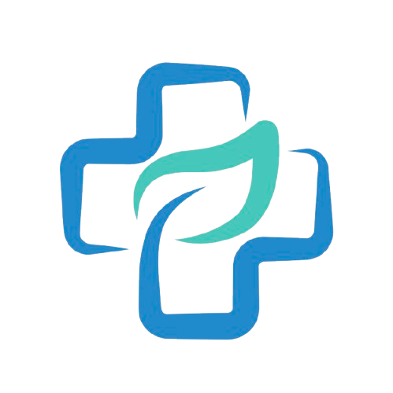

<div align="center">



# AFGMED — Plataforma de Saúde Web e Desktop

Sistema acadêmico de saúde integrado, desenvolvido em Python, com aplicações **Web (Flask)** e **Desktop (PySide6)** utilizando o mesmo banco de dados.

O AFGMED reúne agendamento de consultas, gerenciamento de médicos, catálogo de produtos farmacêuticos, carrinho, entrega, pagamentos e painéis específicos para pacientes, médicos e administradores.


</div>

---

## Sobre o projeto

O **AFGMED** foi criado para centralizar serviços de saúde em uma única plataforma.

O sistema permite que pacientes encontrem médicos, agendem consultas, comprem produtos farmacêuticos e acompanhem seus pedidos. Médicos possuem uma área exclusiva para organizar e concluir atendimentos. Administradores gerenciam médicos, produtos, pedidos e a agenda geral.

As versões Web e Desktop compartilham:

- o mesmo banco SQLite;
- os mesmos usuários;
- os mesmos médicos e produtos;
- as mesmas consultas e pedidos;
- as mesmas regras centrais de negócio;
- permissões equivalentes por perfil.

> Este é um projeto acadêmico e demonstrativo. Não deve ser utilizado em ambiente clínico ou comercial real sem revisão de segurança, privacidade, infraestrutura e conformidade legal.

---

## Tecnologias

### Backend e dados

- Python
- Flask
- Flask-SQLAlchemy
- Flask-Login
- Flask-Bcrypt
- Flask-WTF / CSRFProtect
- SQLite
- python-dotenv

### Aplicação Web

- Jinja2
- HTML5
- CSS3
- JavaScript
- Bootstrap 5
- Bootstrap Icons

### Aplicação Desktop

- PySide6
- Qt Widgets
- QSS para estilização
- QSettings para preferências locais

### Integrações

- Mercado Pago
- Google Maps
- ViaCEP
- Upload de imagens de usuários, médicos e produtos

### Qualidade

- Pytest
- Testes de rotas, autenticação, permissões e regras de negócio

---

## Arquitetura

```text
AFGMED_Desktop/
├── desktop/
│   ├── estilos/                 # Tema, paleta e arquivos QSS
│   ├── telas/                   # Interfaces da aplicação Desktop
│   └── main.py                  # Inicialização do PySide6
│
├── projetoafgmed/
│   ├── instance/                # Banco SQLite local
│   ├── rotas/                   # Rotas Flask separadas por domínio
│   ├── static/
│   │   ├── css/
│   │   ├── fotos_medicos/
│   │   ├── fotos_perfil/
│   │   ├── fotos_produtos/
│   │   └── imagens/
│   ├── templates/               # Páginas Jinja2
│   ├── __init__.py              # Configuração Flask e extensões
│   ├── forms.py                 # Formulários Flask-WTF
│   ├── main.py                  # Inicialização da aplicação Web
│   ├── models.py                # Modelos SQLAlchemy
│   ├── servicos_compras.py      # Carrinho, estoque e pedidos
│   ├── servicos_consultas.py    # Agendamento e disponibilidade
│   ├── servicos_medicos.py      # Vínculo entre médico e usuário
│   ├── servicos_pagamento.py    # Integração Mercado Pago
│   ├── servicos_produtos.py     # Regras de produtos
│   └── status.py                # Status padronizados
│
├── tests/                       # Testes automatizados
├── popular_banco.py             # Dados demonstrativos
├── requirements.txt             # Dependências principais
├── requirements-test.txt        # Dependências de testes
└── README.md
```

A organização separa interface, rotas, modelos e serviços. Dessa forma, regras importantes podem ser reutilizadas pelas versões Web e Desktop.

---

## Decisões técnicas

### Banco compartilhado

As aplicações Web e Desktop utilizam o mesmo banco SQLite. Uma alteração feita em uma interface fica disponível para a outra sem duplicação de dados.

### Serviços centralizados

As principais regras foram retiradas das telas e concentradas em módulos de serviço:

- `servicos_consultas.py`
- `servicos_compras.py`
- `servicos_pagamento.py`
- `servicos_medicos.py`
- `servicos_produtos.py`

Isso reduz divergências entre Web e Desktop e facilita testes e manutenção.

### Controle de acesso por perfil

O sistema possui três perspectivas:

- paciente;
- médico;
- administrador.

As interfaces exibem apenas os recursos autorizados para cada perfil, e as rotas Web também aplicam validações no backend.

### Estoque após pagamento

Adicionar um produto ao carrinho não reduz o estoque. A baixa ocorre apenas quando o pagamento é aprovado.

Antes da baixa, todos os itens do pedido são validados para impedir atualização parcial do estoque.

### Histórico de pedidos

Os dados do produto são copiados para o item do pedido. Assim, o histórico mantém nome, descrição, foto, quantidade e preço mesmo quando o produto original é removido posteriormente.

### Consultas abertas primeiro

Nas agendas, consultas agendadas aparecem antes das encerradas. As consultas abertas são ordenadas da data e horário mais próximos para os mais distantes.

### Status padronizados

Os status de consultas, carrinhos, pedidos e pagamentos ficam centralizados em `status.py`, evitando valores diferentes para a mesma situação.

---

## Funcionalidades

## Paciente

- criação de conta e login;
- atualização de perfil e endereço;
- busca de médicos por nome ou especialidade;
- agendamento de consulta;
- reagendamento de consulta própria;
- cancelamento de consulta própria;
- bloqueio de datas e horários que já passaram;
- bloqueio de horários ocupados;
- catálogo e pesquisa de produtos;
- carrinho lateral;
- alteração de quantidade e remoção de itens;
- validação de estoque;
- preenchimento de endereço;
- consulta de CEP;
- pagamento pelo Mercado Pago;
- acompanhamento de pedidos e pagamentos.

## Médico

- login com conta vinculada ao cadastro profissional;
- acesso exclusivo à área médica;
- visualização das próprias consultas;
- filtro de consultas agendadas para hoje;
- pesquisa por paciente, data e contato;
- consultas abertas exibidas primeiro;
- conclusão de atendimento;
- acesso ao próprio perfil.

O médico não possui acesso a:

- catálogo de produtos;
- carrinho;
- entrega;
- pedidos de compra;
- agendamento como paciente;
- cancelamento de consulta.

## Administrador

- dashboard administrativo;
- cadastro e edição de médicos;
- criação automática ou vínculo de conta médica;
- cadastro, edição, ativação e exclusão de produtos;
- controle de estoque;
- manutenção de produtos em destaque na Web;
- visualização de todos os pedidos;
- pesquisa e filtro em Pedidos gerais;
- visualização de todas as consultas;
- pesquisa e filtro em Agenda geral;
- visão administrativa sem alterar o atendimento médico.

---

## Fluxo de consultas

1. O paciente escolhe um médico.
2. O sistema exibe somente horários válidos.
3. Horários ocupados e horários passados são bloqueados.
4. A consulta é criada com status `agendada`.
5. O paciente pode reagendar ou cancelar a própria consulta.
6. O médico visualiza o atendimento em sua agenda.
7. Após o atendimento, o médico pode marcar a consulta como `concluida`.

Horários configurados atualmente:

```text
09:00
10:00
11:00
14:00
15:00
16:00
```

---

## Fluxo de compra e pagamento

1. O paciente adiciona produtos ao carrinho.
2. O sistema valida disponibilidade e quantidade.
3. O endereço de entrega é informado.
4. Um pedido é criado com uma cópia dos itens.
5. O Mercado Pago gera o checkout.
6. O status é sincronizado pelo retorno, consulta ou webhook.
7. Após a aprovação, o estoque é reduzido.
8. O carrinho é finalizado e o pedido fica disponível no histórico.

---

## Segurança

- senhas armazenadas com BCrypt;
- proteção CSRF nos formulários Web;
- autenticação com Flask-Login;
- validação de propriedade de consultas, pedidos e itens;
- proteção de rotas administrativas;
- separação de permissões por perfil;
- credenciais externas em variáveis de ambiente;
- validação de estoque no backend;
- uso de nomes seguros para arquivos enviados;
- prevenção de acesso médico a rotas de compras.

> Nunca envie o arquivo `.env`, tokens, senhas ou o banco de produção para o GitHub.

---

## Configuração

Crie um arquivo `.env` na raiz do projeto:

```env
SECRET_KEY=troque-por-uma-chave-segura
DATABASE_PATH=projetoafgmed/instance/afgmed.db

MERCADO_PAGO_ACCESS_TOKEN=
APP_BASE_URL=http://127.0.0.1:5000

GOOGLE_MAPS_API_KEY=
```

### Variáveis

| Variável | Descrição |
|---|---|
| `SECRET_KEY` | Chave usada pelo Flask e pela proteção CSRF |
| `DATABASE_PATH` | Caminho do banco SQLite compartilhado |
| `MERCADO_PAGO_ACCESS_TOKEN` | Token da integração com Mercado Pago |
| `APP_BASE_URL` | URL pública ou local usada nos retornos de pagamento |
| `GOOGLE_MAPS_API_KEY` | Chave da integração de mapas e localização |

---

## Instalação

### 1. Clonar o repositório

```bash
git clone https://github.com/AntonioDonizeti/AFGMED_Desktop.git
cd AFGMED_Desktop
```

### 2. Criar o ambiente virtual

No Windows:

```powershell
python -m venv .venv
.\.venv\Scripts\activate
```

No Linux ou macOS:

```bash
python3 -m venv .venv
source .venv/bin/activate
```

### 3. Instalar as dependências

```bash
python -m pip install --upgrade pip
pip install -r requirements.txt
```

Para executar os testes:

```bash
pip install -r requirements-test.txt
```

### 4. Configurar o ambiente

Crie o arquivo `.env` conforme o exemplo da seção anterior.

### 5. Preparar o banco

Se o banco já estiver presente e configurado, esta etapa pode ser ignorada.

Para criar as tabelas em uma instalação nova:

```powershell
python -c "from projetoafgmed import app, database; contexto=app.app_context(); contexto.push(); database.create_all(); contexto.pop()"
```

Para cadastrar médicos e produtos demonstrativos:

```powershell
python popular_banco.py
```

As contas médicas de demonstração usam:

```text
Login: e-mail cadastrado do médico
Senha: 123456
```

> A senha padrão é destinada somente ao ambiente acadêmico e de testes.

---

## Executando a aplicação

### Versão Web

```powershell
python projetoafgmed\main.py
```

A aplicação ficará disponível normalmente em:

```text
http://127.0.0.1:5000
```

### Versão Desktop

```powershell
python desktop\main.py
```

As duas versões devem apontar para o mesmo valor de `DATABASE_PATH`.

---

## Testes

Executar toda a suíte:

```powershell
python -m pytest -v
```

No Windows, também é possível usar:

```powershell
.\executar_testes.bat
```

Os testes verificam, entre outros pontos:

- inicialização da aplicação;
- autenticação;
- registro de rotas;
- permissões por perfil;
- consultas e conflitos de horário;
- carrinho e estoque;
- pedidos;
- pagamentos;
- serviços compartilhados.

---

## Rotas Web principais

| Área | Rota |
|---|---|
| Home | `/` |
| Criar conta | `/criar-conta` |
| Login | `/login` |
| Perfil | `/perfil` |
| Médicos | `/medicos` |
| Agendar ou reagendar | `/consultas/<medico_id>` |
| Meus agendamentos | `/meus_agendamentos` |
| Produtos | `/produtos` |
| Carrinho | `/ver-carrinho` |
| Entrega | `/entrega/<id_carrinho>` |
| Minhas compras | `/minhas-compras` |
| Pedidos gerais — admin | `/admin/pedidos-gerais` |
| Agenda geral — admin | `/admin/agenda-geral` |
| Sucesso do pagamento | `/pagamento/sucesso` |
| Falha do pagamento | `/pagamento/falha` |
| Pagamento pendente | `/pagamento/pendente` |
| Webhook Mercado Pago | `/webhook/mercado-pago` |

---

## Perfis e permissões

| Recurso | Paciente | Médico | Administrador |
|---|:---:|:---:|:---:|
| Produtos e carrinho | Sim | Não | Sim |
| Realizar compra | Sim | Não | Sim |
| Agendar consulta própria | Sim | Não | Sim |
| Reagendar consulta própria | Sim | Não | Sim |
| Cancelar consulta própria | Sim | Não | Sim |
| Visualizar agenda profissional | Não | Sim | Visão geral |
| Concluir consulta | Não | Sim | Não |
| Gerenciar produtos | Não | Não | Sim |
| Gerenciar médicos | Não | Não | Sim |
| Visualizar todos os pedidos | Não | Não | Sim |
| Visualizar todas as consultas | Não | Não | Sim |

---

## Próximas melhorias

- migração do SQLite para PostgreSQL;
- envio de confirmação de consulta por e-mail;
- recuperação de senha;
- notificações de pedidos e agendamentos;
- logs administrativos;
- paginação nas listagens;
- Docker para ambiente de desenvolvimento;
- pipeline de integração contínua;
- cobertura de testes ampliada;
- criação de API REST;
- relatórios administrativos.

---

## Autor

**Antonio Donizeti** e **Fabricio Ferreira**

- GitHub: [@AntonioDonizeti](https://github.com/AntonioDonizeti) / [@FabricioF97](https://github.com/FabricioF97)
- Repositório: [AFGMED_Desktop](https://github.com/AntonioDonizeti/AFGMED_Desktop)

---

## Aviso

O AFGMED é um projeto acadêmico desenvolvido para estudo de:

- Python;
- aplicações Web com Flask;
- aplicações Desktop com PySide6;
- banco de dados com SQLAlchemy;
- autenticação e permissões;
- integração de pagamentos;
- testes automatizados;
- compartilhamento de regras entre interfaces.

Não se trata de um sistema médico homologado.
